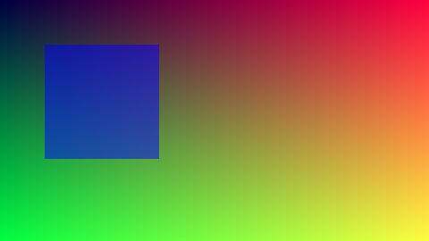

# H　顯示、相機介面、PVTM／PVTPLL

> TRM：Part2 ch7（VOP）、ch9（DPTX）、ch17（PVTM）、ch18（PVTPLL）、ch19（MIPI CSI Host）、ch20（MIPI CSI DPHY）、
> ch21（DSI-2）、ch22（D-PHY/C-PHY Combo）、ch23（eDP TX）、ch24（HDMI TX）、ch25（HDMI RX）、ch26（HDCP2.3）、
> ch27（HDMI TX/eDP Combo PHY）、ch28（HDMI RX PHY）
> 工具：`tools/pvtpll_sweep.sh`

⚠ 實驗時**沒有接任何螢幕或相機**：三個輸出接頭全是 `disconnected`，VOP 是 runtime `suspended`（時脈關著）。
所以這組大部分只能查設定；A 章開頭那次「讀 VOP QoS 把板子卡死」就是在這個狀態下發生的。

## 1. 板上狀況

| 模組 | TRM 數量 | 啟用 | 說明 |
|------|---------|------|------|
| VOP2 | 1（4 個 video port） | okay，suspended | |
| HDMI TX | 2 | TX0、TX1 okay | ROCK 5B 兩個 HDMI 輸出 |
| DP（DPTX） | 2 | DP0 okay | USB-C 的 DP Alt Mode |
| eDP | 2 | 0 | |
| DSI-2 | 2 | 0 | |
| HDMI RX | 1 | okay | `/dev/video0`（V4L2） |
| HDCP 2.3 | 2 | 0 | |
| HDPTX Combo PHY | 2 | 2（HDMI 模式） | |
| MIPI D/C-PHY Combo | 2 | 2 okay | |
| MIPI CSI Host | 6 | 6 okay | 但後端 VICAP/ISP 都 disabled（G §4） |
| MIPI CSI DPHY | 2 | 2 okay | |
| PVTM | 6 | 5 個 `pvtm@` probe | 見 §4 |
| PVTPLL | 6 | 由 BL31 使用 | 見 §5 |

DRM connector：`card0-DP-1`、`card0-HDMI-A-1`、`card0-HDMI-A-2`、`card0-Writeback-1`，全部 disconnected / disabled。

## 2. VOP2（Part2 ch7）

開機時驅動印出的 plane 分配（journal）：

```
vp0 assign plane mask: Cluster0 | Esmart0[0x5],   primary plane phy id: Cluster0[0]
vp1 assign plane mask: Cluster1 | Esmart1[0xa],   primary plane phy id: Cluster1[1]
vp2 assign plane mask: Cluster2 | Esmart2[0x140], primary plane phy id: Cluster2[6]
vp3 assign plane mask: Cluster3 | Esmart3[0x280], primary plane phy id: Cluster3[7]
Esmart0-win0 as cursor plane for vp0 ...
```

TRM：VOP2 有 4 個 video port、4 個 Cluster 圖層 + 4 個 Esmart 圖層。驅動把它們一對一分給 4 個 VP，每個 VP 一個 Cluster 當主圖層、一個 Esmart 當游標。
（mask 的位元編號不連續：Cluster2/3 的 phy id 是 6、7，Esmart2/3 是 8、9 — `0x140` = bit 6+8、`0x280` = bit 7+9。）

本 repo 最近兩個 commit 就是在改這裡：`HACK: drm: rockchip: Prefer non-cluster overlay planes`、`Force enable legacy-cursor-update`。

開機時 VOP 也跑了 opp_select：`bin=0`、`leakage=31`，但接著 `no regulator (vop) found` → `failed to init opp info`，VOP 沒有 DVFS。

## 3. HDMI RX（Part2 ch25、ch28）

```
$ v4l2-ctl -d /dev/video0 --info --list-formats
Driver name : rk_hdmirx
[0] 'BGR3'  [1] 'NV24'  [2] 'NV16'  [3] 'NV12'
$ cat /sys/class/hdmirx/hdmirx/status   → disconnected
```

內建的預設 EDID（`--get-edid`）：

```
00 ff ff ff ff ff ff 00 49 70 88 35 01 00 00 00 2d 1f ...
```

- 廠商碼 `0x4970` → 三個 5-bit 字母 18/11/16 → **"RKP"**
- 產品碼（little endian）`0x3588` —— 就是晶片型號
- 年份 byte 17 = `0x1f` = 31 → 1990 + 31 = **2021**

驅動把 HDMI RX 的中斷綁在 CPU5（`cpu_aff:0x500, Bound_cpu:5`）。沒有訊號源，沒做擷取實驗。

## 4. PVTM（Part2 ch17）

TRM：6 個 PVTM（BIGCORE0/1、LITCORE、NPU、GPU、PMU），都是「環形振盪器 + 計數器」，用來量製程/電壓/溫度造成的速度差。
開機時 5 個 probe：`fda40000`、`fda50000`、`fda60000`、`fdaf0000`、`fdb30000`。

但這一代 CPU 的「體質分數」其實不是從 PVTM 讀，而是從 PVTPLL 讀（DT 有 `rockchip,pvtm-pvtpll`，見下節）。
體質分數怎麼決定電壓與最高頻率：[`rock5b_explore/01`](../rock5b_explore/01_silicon_lottery.md)。

## 5. PVTPLL（Part2 ch18）— 把一個「推測」變成「確定」

`rock5b_explore/01 §9` 發現 CPU 叢集 GRF 的 +0x14/+0x18 讀值 ≈ 目前 CPU 頻率（MHz），當時只能推測原因。TRM ch18 給了答案。

### 5.1 暫存器

TRM Table 18-2（GRF 裡的 PVTPLL 暫存器）：

| offset | 名稱 | 內容 |
|--------|------|------|
| 0x00 | `PVTPLL_CON0_L` | bit0 start、bit1 osc_en、[10:8] osc_ring_sel、[12:11] clk_div_ref、[14:13] clk_div_osc |
| 0x04 | `PVTPLL_CON0_H` | [5:0] ring_length_sel（振盪環長度） |
| 0x08 | `PVTPLL_CON1` | cal_cnt：量測窗長度（單位：ref_clk 週期），重置值 **0x18 = 24** |
| 0x0C | `PVTPLL_CON2` | threshold、ckg_val |
| 0x10 | `PVTPLL_CON3` | ref_cnt |
| 0x14 | `PVTPLL_STATUS0` | **osc_cnt**：量測窗內數到幾個振盪 |
| 0x18 | `PVTPLL_STATUS1` | **osc_cnt_avg**：平均值（DT `rockchip,pvtm-offset = <0x18>` 讀的就是這個） |

⚠ **TRM 落差**：Part1 ch6 的 `BIGCORE_GRF` 暫存器表只列到 0x10（CON0~3），**STATUS0/STATUS1 沒列**；要看 Part2 ch18 才知道。

**為什麼讀值 = MHz**：ref_clk 是 24 MHz，`cal_cnt = 24` → 量測窗 = 24 / 24 MHz = **1 µs**。1 µs 內數到 N 個振盪 = N MHz。

### 5.2 實驗：頻率掃描（`pvtpll_sweep.sh`，大核叢集 2，`BIGCORE1_GRF 0xfd592000`）

```
    freq     mV    CON0_L   CON0_H     CON1     CON2     CON3     osc    avg  ring_sel len
     408    675  00000103 0000000b 00000018 00040000 00000000    1446   1452  1 11
     600    675  00000103 0000000b 00000018 00040000 00000000    1454   1453  1 11
     816    675  00000103 00000021 00000018 00040000 00000000     798    796  1 33
    1008    675  00000103 00000017 00000018 00040000 00000000     998    993  1 23
    1200    675  00000103 00000011 00000018 00040000 00000000    1181   1182  1 17
    1416    700  00000103 0000000d 00000018 00040000 00000000    1419   1424  1 13
    1608    725  00000103 0000000b 00000018 00040000 00000000    1609   1614  1 11
    1800    800  00000103 0000000b 00000018 00040000 00000000    1824   1825  1 11
    2016    875  00000103 0000000b 00000018 00040000 00000000    2005   2010  1 11
    2208    962  00000103 0000000b 00000018 00040000 00000000    2188   2185  1 11
    2256   1000  00000103 0000000b 00000018 00040000 00000000    2258   2251  1 11
```

看得到兩段完全不同的調頻策略：

| 頻段 | 電壓 | 振盪環長度 | 怎麼變快 |
|------|------|-----------|---------|
| 408、600 MHz | 675 mV | 11（沒動） | PVTPLL 沒被當時脈用（osc ≈ 1450 是空轉值），CPU 用一般 PLL |
| 816 → 1200 MHz | **固定 675 mV** | **33 → 23 → 17** | **縮短振盪環**（反相器越少，繞一圈越快） |
| 1416 → 2256 MHz | **700 → 1000 mV** | 13 → **11（最短）** | 環已經最短，改**加電壓** |

- `CON1` 一直是 24（重置值），`osc_ring_sel` 一直是 1
- `osc` 讀值和設定頻率差 < 2%：PVTPLL 本身就是 CPU 的時脈源，BL31 選環長讓它剛好落在目標頻率

### 5.3 回頭驗證開機體質分數

開機量體質的條件（`rockchip_opp_select.c`）：1608 MHz、**750 mV**。1608 MHz 時環長 = 11，
所以「環長 11、750 mV」的振盪頻率，可以用上表環長 11 的點內插：

- 725 mV → 1609 MHz、800 mV → 1824 MHz
- 750 mV ≈ 1609 + (1824 − 1609) × 25/75 ≈ **1681 MHz**

開機實際量到叢集 2（cpu6）的分數：**1689、1696**（兩次開機）。內插值 1681 和實測只差 0.5~0.9% ✅
——開機的「體質分數」就是「這顆晶片在 750 mV 下，最短振盪環能跑多快（MHz）」。

## 6. 其他（無法實驗）

- **DPTX（ch9）/ eDP（ch23）/ DSI-2（ch21）/ D-PHY·C-PHY（ch22）**：DP0 okay 但沒接；eDP、DSI 全 disabled
- **HDMI TX（ch24）/ HDMI-eDP Combo PHY（ch27）**：兩路 okay，沒接螢幕，時脈關著，不能讀暫存器
- **HDCP 2.3（ch26）**：兩個都 disabled
- **MIPI CSI Host（ch19）/ CSI DPHY（ch20）**：控制器 okay，但沒相機、後端 VICAP disabled
- **Writeback connector**：見 §7，已用它在不接螢幕的情況下驗證 VOP

## 7. 不接螢幕驗證 VOP：Writeback connector 實驗（2026-09-26 補）

> 工具：`tools/vop_wb/`（`wbtest.c`、`run_wb.sh`、`analyze.py`、`to_png.py`、`drm/` 核心 uapi 標頭）
> 縮圖：`data/vop_wb/`

### 7.1 原理與做法

VOP2 有一個 **Writeback** 模組（TRM Part2 §7.4.6）：把某個 video port 合成好的畫面，直接寫回 DDR。
DRM 把它包成一個 connector（`card0-Writeback-1`，type 18）。不接螢幕，也能讓 VOP 真的跑一次合成，再逐像素檢查結果。

`wbtest.c` 不用 libdrm，只用核心原始碼的 uapi 標頭（`#define __user` 後直接 include）＋原生 ioctl：
1. 開 `/dev/dri/card0`，打開 client cap：UNIVERSAL_PLANES、ATOMIC、**WRITEBACK_CONNECTORS**
2. 建 dumb buffer 當圖層來源，填測試圖樣；再建一個 dumb buffer 當寫回目標（先填 `0x5a` 垃圾值）
3. 一次 atomic commit：CRTC（`MODE_ID`、`ACTIVE`）＋ 圖層（`FB_ID`、`CRTC_ID`、`SRC_*`、`CRTC_*`）＋
   Writeback connector（`CRTC_ID`、`WRITEBACK_FB_ID`、`WRITEBACK_OUT_FENCE_PTR`）
4. `poll()` 等 out-fence → 存檔 → 關掉 CRTC

**DRM master**：原本以為要 `chvt` 讓 logind 放掉主控權（板子上其實沒裝 `chvt`），結果不用切 VT 也能 commit——
開檔時自動成為 master（`SET_MASTER` 回 EBUSY 可以不管）。Xorg 沒接螢幕，沒在用任何 CRTC，桌面與 VNC 都沒受影響。

**安全網**：`run_wb.sh` 先以 magic-close 方式啟動 WDT（核心活著就代餵；萬一 VOP 把核心弄當，約 89 秒自動重開，見 A §10），
每個情境前寫麵包屑並 `sync`。全程沒出事。

### 7.2 硬體資源

```
resources: 3 crtcs, 4 connectors, 4 encoders
  connector 215 type 18 (Writeback)   217/236 type 11 (HDMI-A)   253 type 10 (DisplayPort)
  wb encoder possible_crtcs = 0x7
  plane 57/98/138  type 1 (primary)  Cluster0/1/2      formats 14
  plane 178        type 0 (overlay)  Cluster3          formats 14
  plane 73/114/154 type 2 (cursor)   Esmart0/1/2       formats 21
  plane 194        type 0 (overlay)  Esmart3           formats 21
```

- TRM：VOP2 有 **4** 個 video port；這台 DT 只開了 **3** 個 CRTC（VP0~2）
- 驅動的 VP 最大輸出（`rockchip_vop2_reg.c`）：VP0 7680×4320、VP1/VP2 4096×2304、VP3 2048×1536（和 TRM 一致）
- Writeback 最大 **1920×1080**，格式 **BGR888 / ARGB8888 / RGB565 / NV12**（`formats_wb[]`）
  ↔ TRM §7.4.6.1：ARGB888、RGB888、RGB565、YUV420 ✅
- 非 master 呼叫 `GETCONNECTOR` 時核心不會 `fill_modes`，所以 Writeback 回報 0 個模式；
  `wbtest.c` 照 `vop2_wb_connector_get_modes()` 自己造兩個：1920×1080（148.5 MHz，htotal 1990、vtotal 1110 → 67.23 Hz）和 960×540

### 7.3 結果總表（9 個情境全部成功）

| 情境 | 設定 | 結果 |
|------|------|------|
| 合成（背景） | Cluster0 放 1920×1080 漸層 | 72335 個取樣點**誤差 0**，沒有任何 `0x5a` 殘留 ✅ |
| 混色：Cluster3 + Coverage | 512×512，A=0x80、B=0xFF | B = **255** → 被當成預乘 ⚠ |
| 混色：Cluster3 + Pre-multiplied | 同上 | B = 255（預乘）✅ |
| 混色：**Esmart3 + Coverage** | 同上 | B = **160** = 255×0.502 + 64×0.498 ✅ |
| 混色：Esmart3 + Pre-multiplied | 同上 | B = 255 ✅ |
| 圖層放大 ×2 | 960×540 1-px 條紋 → 1920×1080 | 水平 **bicubic（Catmull-Rom）**、垂直 **bilinear** |
| Writeback 水平 ÷2 | 1920 → 960 | 兩點雙線性取樣，**沒有低通 → 疊影**（條紋變 25~28，不是平均的 127） |
| Writeback 垂直 ÷2 | 1080 → 540 | **丟掉奇數行**（全部是偶數行的值） |
| RGB565 | 漸層 | 位元完全正確（直接截斷） ✅ |
| NV12 | 8 條色帶 | **BT.601 limited range** |
| BGR888 | 8 條色帶 | ⚠ **R/B 對調** |
| 時間 | 960×540 × 10 幀 | fence 固定等 **2 個 vsync** |




（上：Esmart3 + Coverage，正確的半透明藍；下：Cluster3 + Coverage，藍色飽和。1/4 縮圖。）

### 7.4 發現 1：Coverage 混色在單視窗的 Cluster 圖層上無效

驅動確實收到了 Coverage（debugfs `summary`：`Cluster3-win0 ... pixel_blend_mode[1]`；
DRM 標準值 Pre-multiplied=0、Coverage=1、None=2，實測 enum 也是這樣）。但：

```c
/* rockchip_drm_vop2.c vop2_setup_alpha()，約 10394 行 */
} else if (vop2_cluster_window(win)) {/* Mix output data only have pixel alpha */
	/* The data from cluster mix is always premultiplied alpha */
	alpha_config.src_premulti_en = true;
```

layer mixer 把 Cluster 的輸出一律當成「已預乘」。而 Cluster 內部的 mix（`vop2_setup_cluster_alpha()`，約 10224 行）
只在 **Cluster 同時用兩個視窗**時才會照 blend mode 設定；只用 win0 時 `top_win_vpstate = NULL`，沒人把顏色先乘上 alpha。
→ 不預乘的 ARGB 圖（Coverage）放在單視窗 Cluster 圖層上，會被當成預乘來混，半透明區域變亮、飽和。
**換成 Esmart 圖層就正確**（實測 B=160，平均誤差 0.75）。
（原因是從程式碼推論，實測結果和推論一致。）

### 7.5 發現 2：只有 Writeback 時，像素時脈只有 9.28 MHz

dmesg：

```
vop2_crtc_atomic_enable] Update mode to 1920x1080p67, type: 0(if:, flag:0x0) for vp0 dclk: 148500000
vop2_crtc_atomic_enable] set dclk_vop0 to 0, get 9281250
```

Writeback 不是實體輸出介面（`type: 0`），驅動算出的目標 dclk 是 0，`clk_set_rate(0)` 落到最低：
`dclk_vop0 = 9281250 Hz`（clk_summary 實測，enable_count=1）= 1188 MHz ÷ 128，推測是 GPLL 經最大分頻。

用時間驗證：

| 模式 | 每格像素（htotal×vtotal） | commit 花費 | fence（2 格） | 一格實際 | 換算像素率 |
|------|------------------------|------------|--------------|---------|-----------|
| 1920×1080 | 2 208 900 | 59.9 ms | 119.3 ms | 59.66 ms | **37.0 Mpix/s** |
| 960×540 | 552 225 | 14.6~15.8 ms | 29.3~30.6 ms | 14.8 ms | **37.3 Mpix/s** |

兩種模式都是 ≈ **37.1 Mpix/s = 4 × 9.28 MHz** → VOP2 每個 dclk 處理 4 個像素，而 dclk 只有 9.28 MHz。
- 模式說 67 Hz，實際只有 **16.8 Hz**（1080p）
- debugfs `summary` 卻寫 `real_dclk[148500 kHz]`——那是要求值，不是真實值
- `wbtest` 用模式算的「vsync period 7.44 ms」（960×540）也是錯的，實際 14.8 ms

另外 960×540 那輪 dmesg 出現一串 `vop2_isr *ERROR* POST_BUF_EMPTY irq err at vp0`（1080p 沒有）。原因**待查**。

### 7.6 發現 3：Writeback 的 BGR888 寫出來是 RGB888 的位元組順序

DRM 定義（`drm_fourcc.h`）：`DRM_FORMAT_BGR888 = [23:0] B:G:R little endian` → 記憶體 byte0 = **R**、byte1 = G、byte2 = B。
實測紅色色帶寫成 `00 00 ff`、藍色 `ff 00 00`：byte0 = B、byte2 = R，正好是 `DRM_FORMAT_RGB888` 的排列。
驅動 `vop2_convert_wb_format()`：`DRM_FORMAT_BGR888 → VOP2_WB_BGR888`，硬體的「BGR888」和 DRM 的 BGR888 定義相反。
→ 用 Writeback 抓 24-bit 畫面的程式，R 和 B 會對調。

### 7.7 其他驗證

- **圖層放大 ×2**（條紋 0/255）：驗算 4 個點
  - 垂直：y=100~103 的來源位置 = y × 539/1079 = 49.95、50.45、50.95、51.45 → 線性內插 13、115、242、140；實測 **13、114、242、140** ✅ bilinear
  - 水平：x=101、103 位置 50.47、51.47；bilinear 會是 120、135，Catmull-Rom 算出 **116、139**；實測 **115、139** ✅ bicubic
- **Writeback 垂直 ÷2**：TRM §7.4.6.5「y 方向不縮放，超過兩倍用 wb_ythrow 丟行」；實測結果全是偶數行的值 ✅
- **NV12**：用 R/G/B 三原色反推 Y = 0.2549 R + 0.5020 G + 0.0980 B + 16；BT.601 limited 是 0.2568/0.5041/0.0979/+16 ✅。
  白 Y=235、黑 Y=16，紅 V=240、藍 U=240（limited range 上限）。debugfs 也寫 `color-encoding[BT.601] color-range[Limited]`
- **fence 時間**：永遠是 2 個 vsync，對應驅動 `vop2_wb_handler()` 的 `fs_vsync_cnt == 2` 才 `drm_writeback_signal_completion()`
